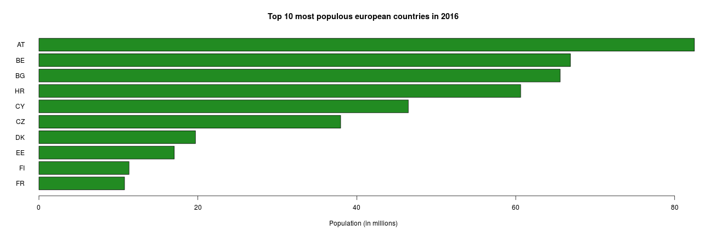

Estimates for the Population of European Countries - a simple Application
========================================================
author: Jorge Grave
date: 11/12/2017
width: 1920
height: 1200
autosize: true

Summary
========================================================

### Objectives

Create an App which presents estimates for the population of european countries for a given year, selected by the user.

### Data used

Population of european countries in the years of 1960 and 2016. These data were obtained from www.pordata.pt

### User Input

The user selects the year using a slidebar and chooses which plot to view by clicking on the corresponding tab.

### Estimation algorithm 

Us a simple linear model with the data for the two available years to estimate new values for the population in the year selected by the user

### Output

- A map of europe with the countries shown with a color scale according to their population in the year selected by the user
- A barplot with the top 10 most populous european countries for the year 
selected by the user

Data and Algorithm
========================================================

The server file loads the data from the file "europop.csv"

```r
DF <- read.csv('europop.csv')
head(DF)
```

```
            countries   X1960    X2016
1        AT - Austria 7047539  8731471
2        BE - Belgium 9153489 11338476
3       BG - Bulgaria 7867374  7127822
4        HR - Croatia 4140181  4172441
5         CY - Cyprus  572783   851561
6 CZ - Czech Republic 9602006 10566332
```

and fits a linear model to the data in each line of the table. The corresponding coefficients are stored in the object 'models' and then used to predict new values for the populations.


```r
models <- NULL
for (i in 1:nrow(DF)){
  fit <- lm(as.numeric(DF[i,2:3]) ~ c(1960,2016))
  models <- rbind(models,fit$coefficients[1:2])
}
head(models,n=5)
```

```
     (Intercept) c(1960, 2016)
[1,]   -51890081    30070.2143
[2,]   -67321056    39017.6250
[3,]    33751694   -13206.2857
[4,]     3011081      576.0714
[5,]    -9184447     4978.1786
```

Input and Output
========================================================

The user starts by choosing the year for which he wants to visualize the estimates of the population by using a slidebar in the sidepanel.


```r
sliderInput("year", "Please select the year:", min = 1960, max = 2300, value = 1960, step = 10,sep = "")
```

In the main panel, the user can choose between two tabs. The first one shows a map the european countries coulored by their population in the year selected by the user. We can see an example of a chart like that for the year 2016 bellow


```r
g <- gvisGeoChart(data = DF, locationvar = "countries", colorvar = "X2016", 
    options = list(region = "150", displayMode = "regions", resolution = "countries", 
        width = 900, height = 600))
plot(g)
```

<!-- GeoChart generated in R 3.2.3 by googleVis 0.6.2 package -->
<!-- Mon Dec 11 18:51:17 2017 -->


<!-- jsHeader -->
<script type="text/javascript">
 
// jsData 
function gvisDataGeoChartID67d8584a230 () {
var data = new google.visualization.DataTable();
var datajson =
[
 [
"AT - Austria",
8731471
],
[
"BE - Belgium",
11338476
],
[
"BG - Bulgaria",
7127822
],
[
"HR - Croatia",
4172441
],
[
"CY - Cyprus",
851561
],
[
"CZ - Czech Republic",
10566332
],
[
"DK - Denmark",
5728010
],
[
"EE - Estonia",
1315790
],
[
"FI - Finland",
5495303
],
[
"FR - France",
66892205
],
[
"DE - Germany",
82487842
],
[
"GR - Greece",
10770521
],
[
"HU - Hungary",
9814023
],
[
"IE - Ireland",
4749777
],
[
"IT - Italy",
60627498
],
[
"LV - Latvia",
1959537
],
[
"LT - Lithuania",
2868231
],
[
"LU - Luxembourg",
583458
],
[
"MT - Malta",
437418
],
[
"NL - Netherlands",
17030314
],
[
"PL - Poland",
37970087
],
[
"PT - Portugal",
10325452
],
[
"RO - Romania",
19699312
],
[
"SK - Slovakia",
5430798
],
[
"SI - Slovenia",
2065042
],
[
"ES - Spain",
46484533
],
[
"SE - Sweden",
9923085
],
[
"UK - United Kingdom",
65595565
],
[
"IS - Iceland",
335439
],
[
"NO - Norway",
5236151
],
[
"CH - Switzerland",
8372413
] 
];
data.addColumn('string','countries');
data.addColumn('number','X2016');
data.addRows(datajson);
return(data);
}
 
// jsDrawChart
function drawChartGeoChartID67d8584a230() {
var data = gvisDataGeoChartID67d8584a230();
var options = {};
options["width"] = 900;
options["height"] = 600;
options["region"] = "150";
options["displayMode"] = "regions";
options["resolution"] = "countries";

    var chart = new google.visualization.GeoChart(
    document.getElementById('GeoChartID67d8584a230')
    );
    chart.draw(data,options);
    

}
  
 
// jsDisplayChart
(function() {
var pkgs = window.__gvisPackages = window.__gvisPackages || [];
var callbacks = window.__gvisCallbacks = window.__gvisCallbacks || [];
var chartid = "geochart";
  
// Manually see if chartid is in pkgs (not all browsers support Array.indexOf)
var i, newPackage = true;
for (i = 0; newPackage && i < pkgs.length; i++) {
if (pkgs[i] === chartid)
newPackage = false;
}
if (newPackage)
  pkgs.push(chartid);
  
// Add the drawChart function to the global list of callbacks
callbacks.push(drawChartGeoChartID67d8584a230);
})();
function displayChartGeoChartID67d8584a230() {
  var pkgs = window.__gvisPackages = window.__gvisPackages || [];
  var callbacks = window.__gvisCallbacks = window.__gvisCallbacks || [];
  window.clearTimeout(window.__gvisLoad);
  // The timeout is set to 100 because otherwise the container div we are
  // targeting might not be part of the document yet
  window.__gvisLoad = setTimeout(function() {
  var pkgCount = pkgs.length;
  google.load("visualization", "1", { packages:pkgs, callback: function() {
  if (pkgCount != pkgs.length) {
  // Race condition where another setTimeout call snuck in after us; if
  // that call added a package, we must not shift its callback
  return;
}
while (callbacks.length > 0)
callbacks.shift()();
} });
}, 100);
}
 
// jsFooter
</script>
 
<!-- jsChart -->  
<script type="text/javascript" src="https://www.google.com/jsapi?callback=displayChartGeoChartID67d8584a230"></script>
 
<!-- divChart -->
  
<div id="GeoChartID67d8584a230" 
  style="width: 900; height: 600;">
</div>

Input and Output
=====================================================

In the second tab, the application shows a barplot with the top 10 countries by population for the year selected by the user. An example of such a plot for the year 2016 is shown bellow with the code to generate it. In order to do that, we include the cycle which calculates the predictions using the coefficients stored in the object 'models'.


```r
pop <- NULL
    DF2 <- DF
    for (i in 1:nrow(DF)){
      pred <- models[i,1]+models[i,2]*2016
      pop <- c(pop,as.numeric(round(pred)))
    }
    DF2$pop <- pop
    DF2 <- DF2[order(-pop),]
countrycode <- substr(DF$countries,1,2) 
barplot(DF2$pop[10:1]/1000000,horiz=TRUE,names.arg=countrycode[10:1],las=1,
            main=paste("Top 10 most populous european countries in",
                       as.character(2016)),
            xlab = "Population (in millions)",col="forestgreen")
```


